# Resend Email Verification Setup Guide

## 🎯 Current Setup (Test Mode)

Your app is currently configured to work with **Resend in test mode**, which has specific restrictions.

### Test Mode Restrictions

> [!IMPORTANT]
> **Resend test mode only allows sending emails to your account email**: `yordanosyohans7@gmail.com`
> 
> To send emails to other recipients, you must verify a custom domain.

---

## ⚙️ Environment Variables

Add these to your `.env.local` file:

```bash
# Resend Configuration
RESEND_API_KEY=re_CVyPT... # Your Resend API key
RESEND_ACCOUNT_EMAIL=yordanosyohans7@gmail.com # Account owner email (for test mode)

# Auth Configuration
BETTER_AUTH_URL=http://localhost:3000
CORS_ORIGIN=http://localhost:3001
NODE_ENV=development
```

### Variable Descriptions

| Variable | Description | Required |
|----------|-------------|----------|
| `RESEND_API_KEY` | Your Resend API key from [resend.com/api-keys](https://resend.com/api-keys) | ✅ Yes |
| `RESEND_ACCOUNT_EMAIL` | Email address registered with Resend (used for test mode validation) | ✅ Yes |
| `BETTER_AUTH_URL` | Your backend server URL | ✅ Yes |
| `CORS_ORIGIN` | Your frontend app URL | ✅ Yes |
| `NODE_ENV` | Environment (development/production) | ⚠️  Recommended |

---

## 🧪 Testing in Development

### Option 1: Use Test Email

For testing, create an account with: **yordanosyohans7@gmail.com**

```bash
# This will work in test mode
Email: yordanosyohans7@gmail.com
Password: YourPassword123!
```

### Option 2: Update Test Email

If you want to test with a different email, update the environment variable:

```bash
RESEND_ACCOUNT_EMAIL=your-new-test-email@gmail.com
```

> [!CAUTION]
> The email in `RESEND_ACCOUNT_EMAIL` **MUST** match the email registered with your Resend account, or emails will fail with a 403 error.

---

## 🚀 Production Setup (Domain Verification)

To send emails to **any email address** in production, you need to verify your domain with Resend.

### Step 1: Add Domain

1. Go to [resend.com/domains](https://resend.com/domains)
2. Click "Add Domain"
3. Enter your domain (e.g., `yalegn.com`)

### Step 2: Add DNS Records

Resend will provide you with DNS records to add to your domain:

- **SPF Record** (TXT) - Sender Policy Framework
- **DKIM Record** (TXT) - DomainKeys Identified Mail
- **DMARC Record** (TXT) - Domain-based Message Authentication

Add these records to your domain's DNS settings (in your domain registrar).

### Step 3: Verify Domain

After adding DNS records (may take up to 48 hours):
1. Return to Resend dashboard
2. Click "Verify" next to your domain
3. Wait for verification to complete

### Step 4: Update Code

Once verified, update the `from` email in [`packages/auth/src/index.ts`](file:///home/yordanos/Desktop/A/Beta/my-better-t-app/packages/auth/src/index.ts#L91):

```typescript
// Change from:
from: "Yalegn Verification <onboarding@resend.dev>",

// To:
from: "Yalegn <noreply@yourdomain.com>", // Use your verified domain
```

### Step 5: Remove Test Restrictions

In [`packages/auth/src/index.ts`](file:///home/yordanos/Desktop/A/Beta/my-better-t-app/packages/auth/src/index.ts#L87-L106), you can remove or modify the test mode check:

```typescript
// You can remove this entire block after domain verification:
if (isDevelopment && user.email !== RESEND_ACCOUNT_EMAIL) {
  // ... validation code
}
```

Or update to only apply in development:

```typescript
// Set NODE_ENV=production to disable test restrictions
const isDevelopment = process.env.NODE_ENV !== "production";
```

---

## 🐛 Troubleshooting

### Error: "You can only send testing emails to..."

**Cause**: Attempting to send to an email that doesn't match `RESEND_ACCOUNT_EMAIL` in test mode.

**Solution**:
- Use the registered email for testing, OR
- Verify a custom domain

### Error: "RESEND_API_KEY is required"

**Cause**: Missing or incorrect API key.

**Solution**:
1. Get your API key from [resend.com/api-keys](https://resend.com/api-keys)
2. Add to `.env.local`: `RESEND_API_KEY=re_...`
3. Restart your server

### Email Not Received

**Checklist**:
- ✅ Check spam/junk folder
- ✅ Verify email address is correct
- ✅ Check server logs for errors
- ✅ Verify `RESEND_ACCOUNT_EMAIL` matches your Resend account

---

## 📊 How It Works

### Email Flow

```mermaid
flowchart TD
    A[User Clicks 'Send Verification Email'] --> B{Email matches RESEND_ACCOUNT_EMAIL?}
    B -->|Yes - Test Mode| C[Send via Resend API]
    B -->|No - Test Mode| D[Show Error Message]
    B -->|Production Mode| E[Check Domain Verified?]
    E -->|Yes| C
    E -->|No| D
    C --> F[Email Sent Successfully]
    D --> G[User Sees Friendly Error]
    F --> H[User Clicks Verification Link]
    H --> I[Email Verified]
    I --> J[Award 30 Welcome Coins]
```



### Error Handling

The app now provides **user-friendly error messages** instead of technical errors:

- **Before**: `validation_error: 403`
- **After**: `⚠️ Email verification is currently in test mode. Only yordanosyohans7@gmail.com can receive verification emails.`

---

## 🎁 Verification Rewards

When a user successfully verifies their email:
- ✅ Email marked as verified in database
- ✅ 30 welcome coins awarded automatically
- ✅ Profile completion percentage increases
- ✅ Access to verification-gated features unlocked

---

## 📝 Related Files

- [Better Auth Config](file:///home/yordanos/Desktop/A/Beta/my-better-t-app/packages/auth/src/index.ts#L78-L217) - Email sending logic
- [tRPC User Router](file:///home/yordanos/Desktop/A/Beta/my-better-t-app/packages/api/src/routers/user.ts#L1171-L1241) - Email verification endpoint
- [Test Script](file:///home/yordanos/Desktop/A/Beta/my-better-t-app/packages/auth/test-resend.ts) - Resend API testing

---

## 💡 Quick Reference

```bash
# Test Resend API
cd packages/auth
tsx test-resend.ts

# Start dev server
npm run dev

# Check server logs for email debug info
# Look for: 📧 Sending verification email to: ...
```
